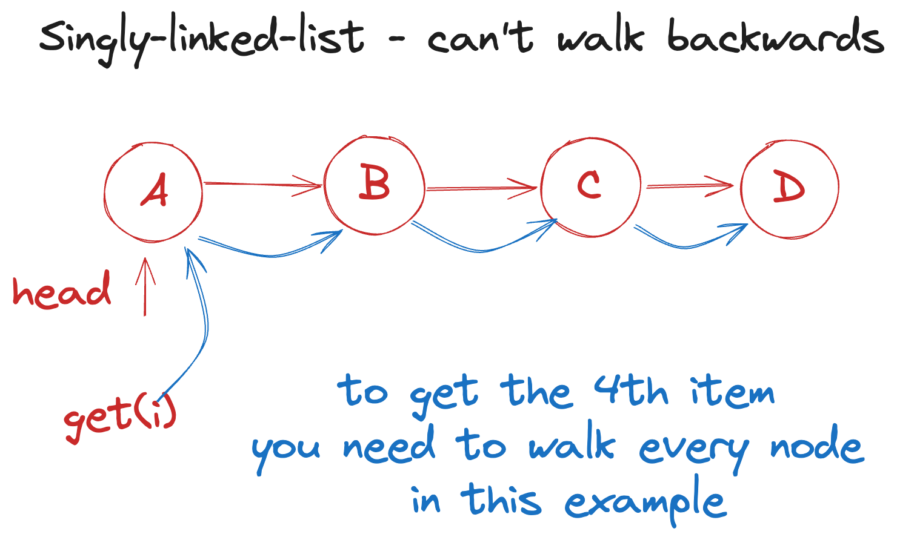

# Linked list



```js
Node<T>
val: T
next?: Node<T>
prev?: Node<T> // if we have a doubly linked list
```

Insertion means just setting next and prev to a new node. It does not depend on the size of the list.
In short: Inserting is O(1). Same for deletion.

There is no way to access the 5th value directly. You need to traverse the list.