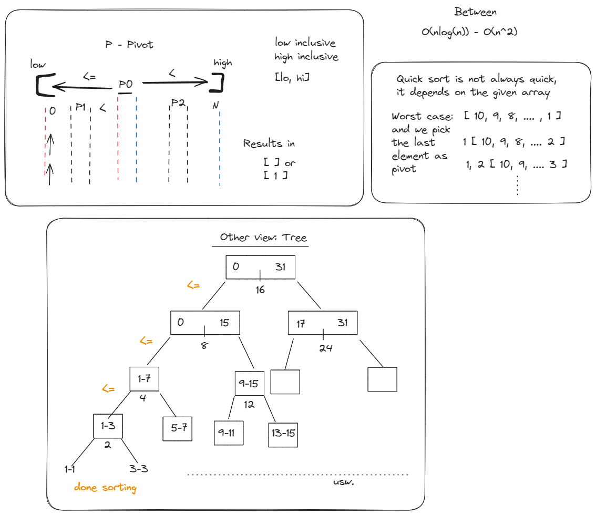

# Quicksort

There are different sorting algorithm strategies classifications like:

- Greedy (Linear Search is one of those)
- Divide and Conquer (Merge sort)
- Dynamic programming (uuuuuurgh)
- ...



```js
function qs(arr: number[], lo: number, hi: number): void {
  if (lo >= hi) {
    return;
  }

  const pivotIdx = partition(arr, lo, hi);

  qs(arr, lo, pivotIdx - 1);
  qs(arr, pivotIdx + 1, hi);
}

function partition(arr: number[], lo: number, hi: number): number {
  const pivot = arr[hi]; // this can cause the worst case. this can be chosen freely

  let idx = lo - 1;

  for (let i = lo; i < hi; i++) {
    if (arr[i] <= pivot) {
      idx++;
      // swap
      const tmp = arr[i];
      arr[i] = arr[idx];
      arr[idx] = tmp;
    }
  }

  // move pivot, so that everything to the left
  // is smaller and everything to the right
  // is bigger than the pivot
  idx++;
  arr[hi] = arr[idx];
  arr[idx] = pivot;

  return idx; // return the pivot index
}

export default function quick_sort(arr: number[]): void {
  qs(arr, 0, arr.length - 1); // inclusive [lo, hi]
}
```
