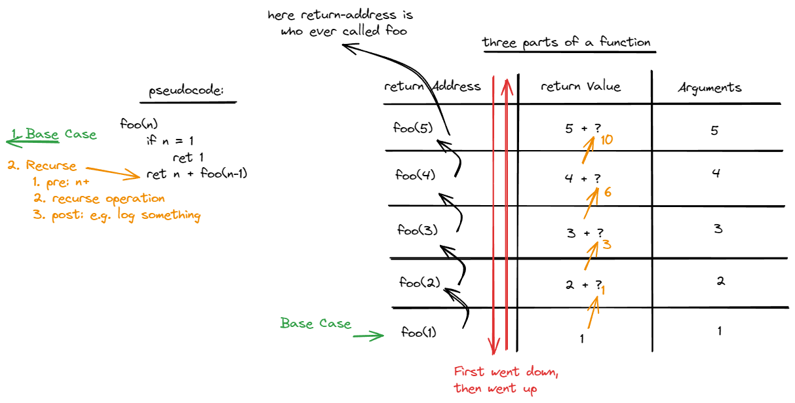

# Recursion

The simplest way to think of recursion is a function that calls itself until the problem is solved. This usually involves what is referred to as a "base case." A base case is the point in which the problem is solved at.

```js
// I always hated this example, but I think its the simplest
function foo(n: number): number {
  // Base Case
  if (n === 1) {
    return 1;
  }

  // We shall Recurse!
  return n + foo(n - 1);
}
```


