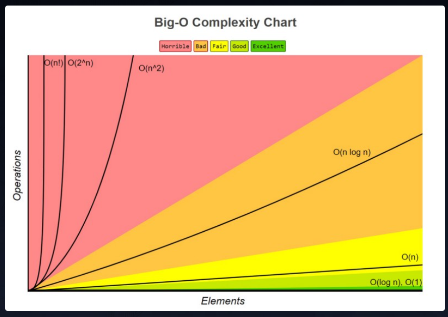

# Big O Notation

See also: [Big O Complexity](../../primeagen/Complexity.md)

There are a lot of existing algorithms; some are fast and some are slow. Some use lots of memory. It can be hard to decide which algorithm is the best to solve a particular problem. "Big O" analysis (pronounced "Big Oh", not "Big Zero") is one way to compare the practicality of algorithms.

> Big O is a characterization of algorithms according to their worst-case growth rates

We write Big-O notation like this:

```txt
O(formula)
```

Where formula describes how an algorithm's run time or space requirements grow **as the input size grows**.

- `O(1)` - constant
- `O(n)` - linear
- `O(n^2)` - squared
- `O(2^n)` - exponential
- `O(n!)` - factorial

The following chart shows the growth rate of several different Big O categories. The size of the input is shown on the `x axis` and how long the algorithm will take to complete is shown on the `y axis`.



sorrc: <https://www.bigocheatsheet.com/>

As the size of inputs grows, the algorithms become slower to complete (take longer to run). The rate at which they become slower is defined by their Big O category.

For example, `O(n)` algorithms slow down more slowly than `O(n^2)` algorithms.
