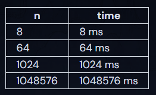
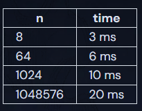
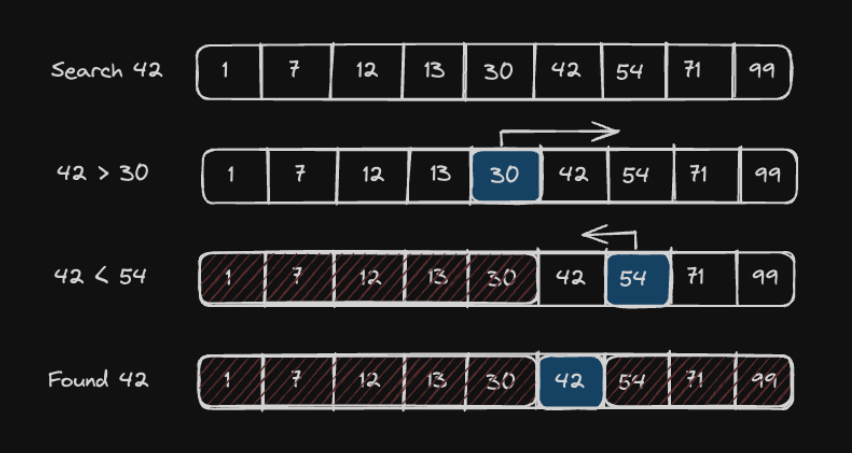

# Order Log N

`O(log(n))` algorithms are only slightly slower than `O(1)`, but much faster than `O(n)`. They do grow according to the input size, `n`, but only according to the log of the input.

`O(n)`:



`O(log(n))`:



## Binary Search



A binary search algorithm is a common example of an `O(log(n))` algorithm. Binary searches work on a pre-sorted list of elements.

### Pseudocode

Given two inputs:

1. An array of `n` elements sorted from least to greatest
2. A `target` value:

Do the following:

- Set `low = 0` and `high = n - 1`.
- While `low <= high`:
  - Set median (the position of the middle element) to `(low + high) // 2`, which is the greatest integer less than or equal to `(low + high) / 2`
  - If `array[median] == target`, return `True`
  - Else if `array[median] < target`, set low to `median + 1`
  - Otherwise set high to `median - 1`

- Return `False`

At each iteration of loop, we halve the list. Which makes the algorithm `O(log(n))`. In other words, to add one more step to the runtime, we'd have to double the size of the input. Binary searches are fast.

### Implementation

```py
def binary_search(target, arr):
    low = 0
    high = len(arr) - 1
    while low <= high:
        mid = (low + high) // 2
        if arr[mid] == target:
            return True
        elif arr[mid] < target:
            low = mid + 1
        else:
            high = mid - 1
    return False
```
