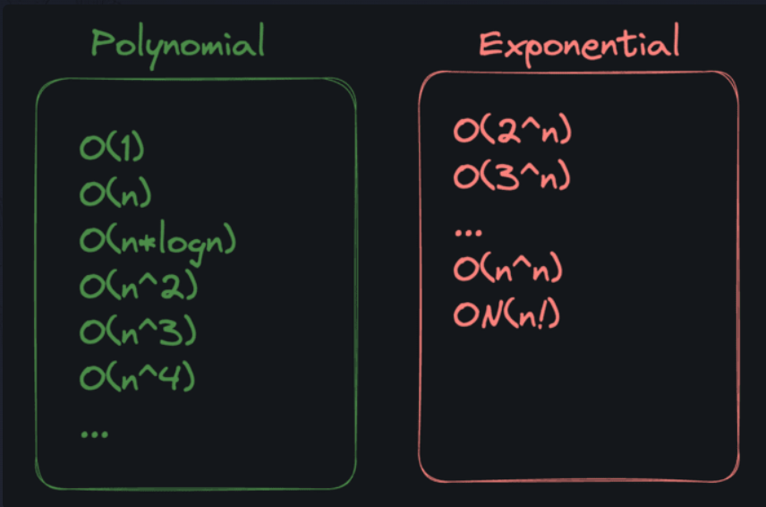
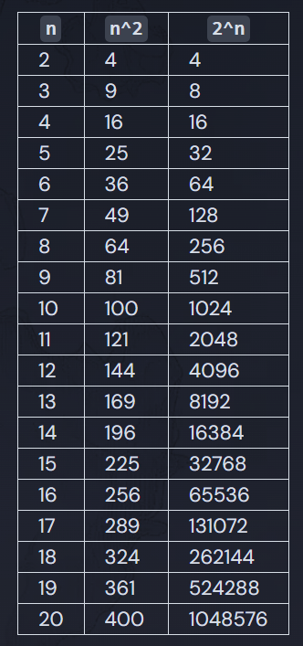

# Polynomial vs Exponential

Broadly speaking, algorithms can be classified into two categories:

- "Polynomial time"
- "Exponential time"

Technically `O(n!)` is "factorial" time, but let's lump them together for simplicity

An algorithm runs in "Polynomial time" if its runtime does not grow faster than `n^k`, where `k` is any constant (e.g. `n^2`, `n^3`, etc) and n is the size of the input.

To put it simply, polynomial time algorithms can be useful, but exponential time algorithms are almost always too slow to be practical (unless you're trying to force someone to be slow, like in the case of cryptography and security). Even when `n` is as low as `20`, `2^n` is already over a million!

## Polynomial Time = P

Back in the 1970s, some computer scientist researchers wanted to come up with a good, descriptive name for the set of polynomial time algorithms. After much deliberation, they settled on the letter `P` (naming things is hard).

The hand-wavy takeaway is that:

- Problems that fall into class `P` are practical to solve on computers.
- Problems that don't fall into `P` are hard, slow, and impractical.
