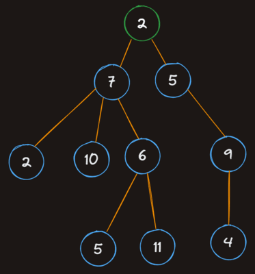

# Trees

Trees are a widely used data structure that simulate a hierarchical... well... tree structure. That said, they're typically drawn upside down - the "root" node is at the top, and the "leaves" are at the bottom.



Trees are kind of like linked lists in the sense that the root node simply holds references to its child nodes, which in turn hold references to their children. The difference between a Linked List and a Tree is that a tree's nodes can have multiple children instead of just one.

A generic tree structure has the following rules:

- Each node has a value and a list of "children"
- Children can only have a single "parent"

## Linked List

```txt
node -> node -> node
```

## Tree

Drawn from left to right in this case:

```txt
            > node
      > node
            > node
> node
            > node
      > node
            > node
```
