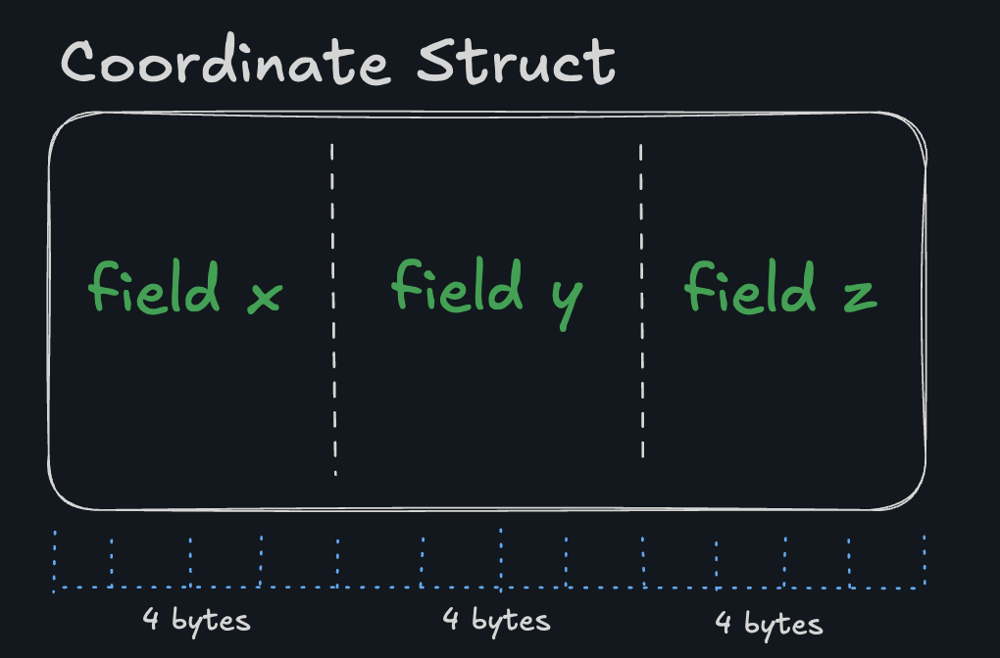
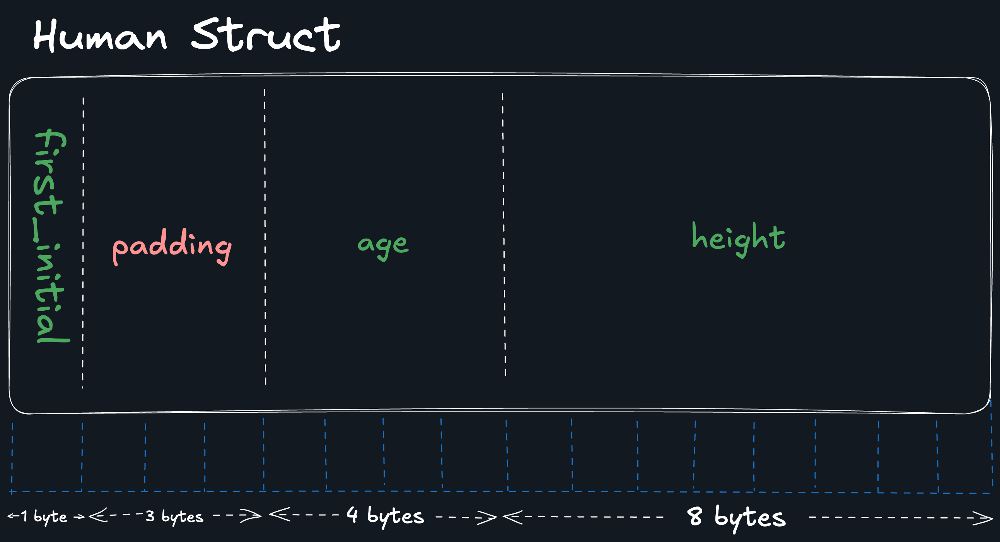

# Sizeof

As we saw earlier, sizeof can be used to view the size of a type (for once, programmers thought of a name that was actually helpful). But this isn't just true of builtin types like int or float, you can also use it to find out the size of structs!

```c
printf("Size of coordinate_t: %zu bytes\n", sizeof(coordinate_t));
```

## Memory Layout

Structs are stored contiguously in memory one field after another. Take this struct:

```c
typedef struct Coordinate {
    int x;
    int y;
    int z;
} coordinate_t;
```

Assuming int is 4 bytes, the memory layout for coordinate_t would look like:



## Mixed type structs

```c
typedef struct Human{
    char first_inital;
    int age;
    double height;
} human_t;
```

Assuming char is 1 byte, int is 4 bytes, and double is 8 bytes, the memory layout for human_t might look like this:



Wait! What is that padding doing here?

It turns out that CPUs don't like accessing data that isn't aligned (incredible oversimplification alert, since obviously CPUs don't have feelings (yet)), so C inserts padding to maintain alignment (e.g. every 4 bytes in this example).

Huge caveat: these layouts can vary depending on the compiler and system architecture.