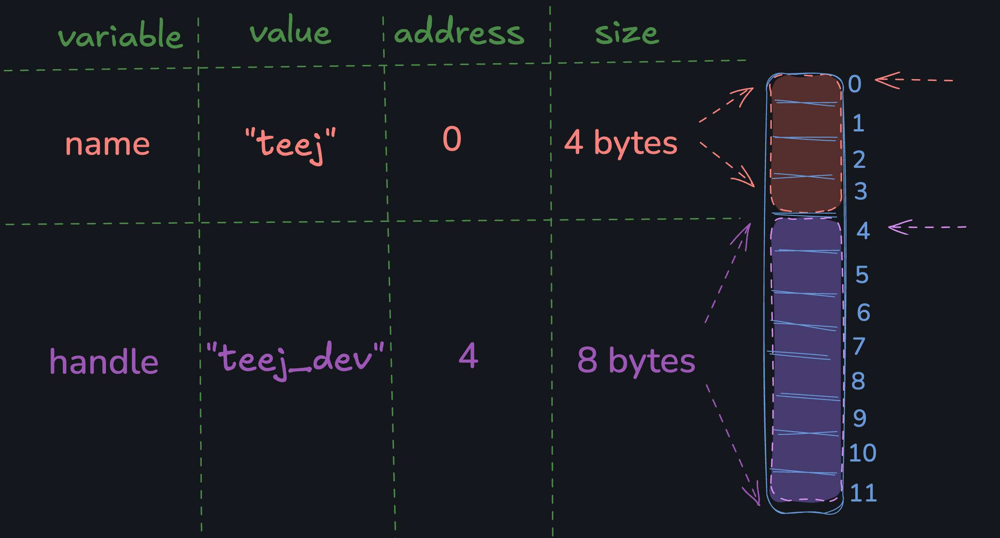

# Memory

Before we talk about pointers, we should talk about variables and memory in general. Here are some useful (albeit hand-wavy) mental models:

> Variables are human readable names that refer to some data in memory.

> Memory is a big array of bytes, and data is stored in the array.

A variable is a human readable name that refers to an address in memory, which is an index into the big array of bytes. Here's a diagram:



## Getting a Variable's Address

In C, you can print the address of a variable by using the address-of-operator: `&`. Here's an example:

```c
#include <stdio.h>

int main() {
  int age = 37;
  printf("The address of age is: %p\n", &age);
  return 0;
}

// The address of age is: 0xfff8
```

Note: The `%p` format specifier will format a pointer (memory address) to be printed.

