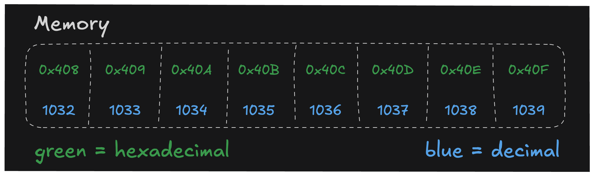

# What is an Address?

So I mentioned in the last lesson that memory can be thought of as a big array of bytes, and each byte has an address.

That's true, and the beauty is that each address is literally just a number. It's not some mortal address like "1234 Elm St." or "1600 Pennsylvania Ave." It's just a number.

You might be thinking, "Hey, if it's just a number, why does it look all disgusting like `0xfff8`?"

That's because `0xfff8` is just a number. But:

It's written in `hexadecimal` (base 16) instead of decimal (base 10).
It's a pretty big number, so it's not very human readable. `0xfff8` is the same as `65,528` in decimal.

