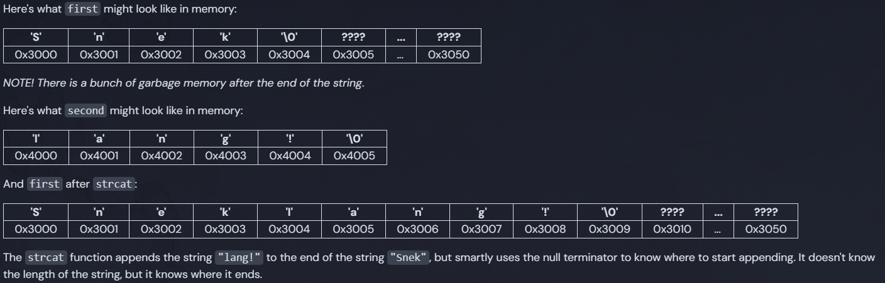

# C Strings

Since the beginning of the course we've been doing these shenanigans to be able to print strings:

```c
char *msg = "ssh terminal.shop for the best coffee";
```

I told you not to worry about the weird `char *` syntax, but now that we understand a bit about pointers, let's dive into it. In the example above, `msg` is a pointer to the first character of the string `"ssh terminal.shop for the best coffee"`, which is a C string. C strings are:

- How we represent text in C programs
- Any number of characters (`chars`) terminated by a null character (`'\0'`).
- A pointer to the first element of a character array.

It's important to understand that most string manipulation in C is done using pointers to move around the array and the null terminator is critical for determining the end of the string. In the example above, the string `"ssh terminal.shop for the best coffee"` is stored in memory as an array of characters, and the null terminator `'\0'` is automatically added at the end.

## C Strings are Simple

- Unlike other programming languages, C strings do not store their length.
- The length of a C string is determined by the position of the null terminator (`'\0'`).
- Functions like strlen calculate the length of a string by iterating through the characters until the null terminator is encountered.
 -This lack of length storage requires careful management to avoid issues such as buffer overflows and off-by-one errors during string operations.

## Pointers vs Arrays

You can declare strings in C using either arrays or pointers:

```c
char str1[] = "Hi";
char *str2 = "Snek";
printf("%s %s\n", str1, str2);
// Output: Hi Snek
```

The output is the same. Let's break down the memory of this example:

```c
// notice we aren't using all 50 characters
char first[50] = "Snek";
char *second = "lang!";
strcat(first, second);
printf("Hello, %s\n", first);
// Output: Hello, Sneklang!
```

The strcat function appends its second argument to the first argument. In this case, it appends "lang!" to "Snek", resulting in the output Hello, Sneklang!.



## String concat example

```c
#include "exercise.h"

void concat_strings(char *str1, const char *str2) {
  char *end = str1;
  while (*end != '\0') {
    end++;
  }

  while (*str2 != '\0') {
    *end = *str2;
    end++;
    str2++;
  }

  *end = '\0';
}
```
