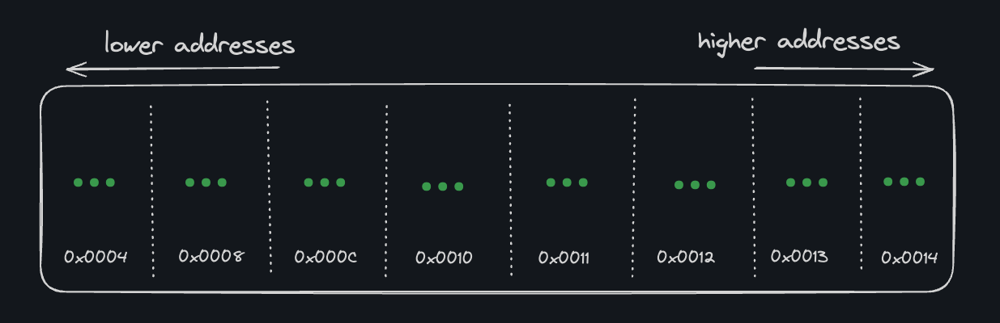
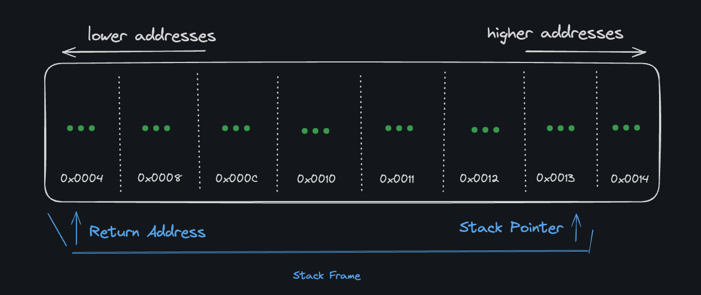
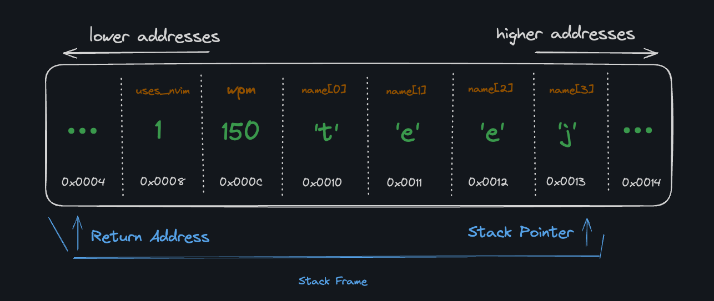

# The Stack

Remember how I told you that memory is basically just a giant array of bytes with addresses at various offsets?

That's true, but it also has some additional structure. In particular, memory is divided into two main regions: the stack and the heap. We'll cover the heap later.

The stack is where local variables are stored. When a function is called, a new stack frame is created in memory to store the function's parameters and local variables. When the function returns, its entire stack frame is deallocated.

The stack is aptly named: it is a stack (the "Last In, First Out" data structure) of memory frames. Each time a function is called, a new frame is pushed onto the stack. When the function returns, its frame is popped off the stack.

Take a look at this example function:

```c
void create_typist(int uses_nvim) {
  int wpm = 150;
  char name[4] = {'t', 'e', 'e', 'j'};
}
```

Say we call create_typist(1). Before the call, our stack memory might look like this, with the next memory address to be used 0x0004:



Once called, the stack pointer is moved to make room for:

- The return address (to pick up execution after the function returns)
- Arguments to the function
- Local variables in the function body



and the local variables are stored in the stack frame:



When the function returns, the stack frame is deallocated by resetting the stack pointer to where the frame began.

## Why a Stack?

Allocating memory on the stack is preferred when possible because the stack is faster and simpler than the heap (which we'll get to, be patient):

- *Efficient Pointer Management*: Stack "allocation" is just a quick increment or decrement of the stack pointer, which is extremely fast. Heap allocations require more complex bookkeeping.
- *Cache-Friendly Memory Access*: Stack memory is stored in a contiguous block, enhancing cache performance due to spatial locality.
- *Automatic Memory Management*: Stack memory is managed automatically as functions are called and as they return.
- *Inherent Thread Safety*: Each thread has its own stack. Heap allocations require synchronization mechanisms when used concurrently, potentially introducing overhead.`
