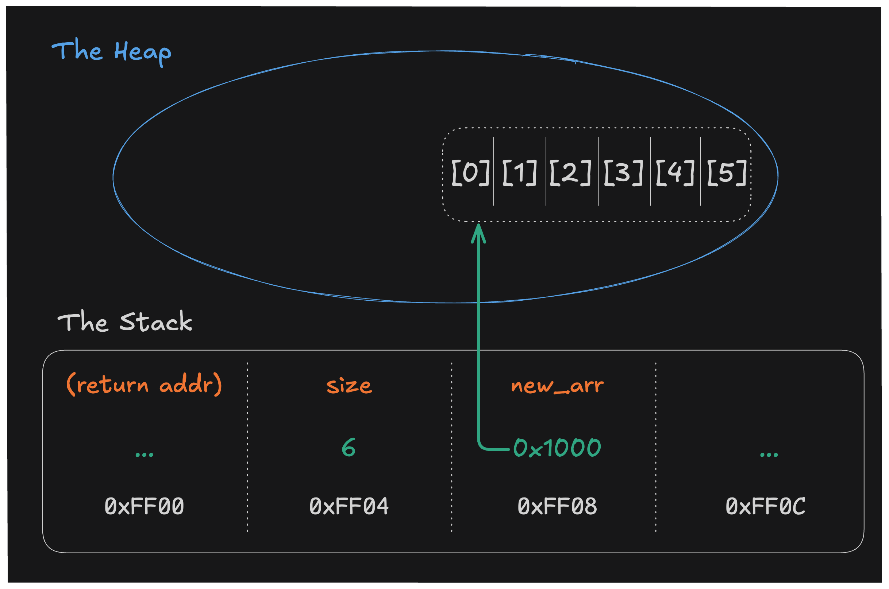
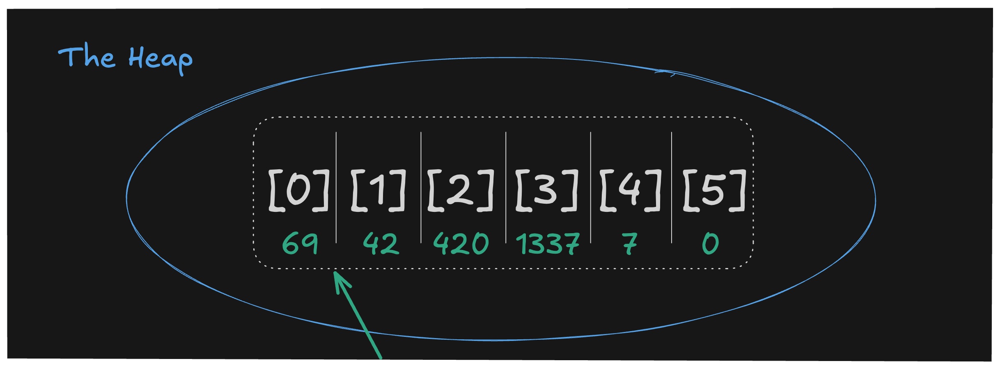

# The Heap

"The heap", as opposed to "the stack", is a pool of long-lived memory shared across the entire program. Stack memory is automatically allocated and deallocated as functions are called and return, but heap memory is allocated and deallocated as-needed, independent of the burdensome shackles of function calls.

When you need to store data that outlives the function that created it, you'll send it to the heap. The heap is called "dynamic memory" because it's allocated and deallocated as needed. Take a look at new_int_array:

```c
int *new_int_array(int size) {
  int *new_arr = (int*)malloc(size * sizeof(int)); // Allocate memory
  if (new_arr == NULL) {
    fprintf(stderr, "Memory allocation failed\n");
    exit(1); // Exit if allocation fails
  }
  return new_arr;
}
```

Because the size of the array isn't known at compile time, we can't put it on the stack. Instead, we allocate memory on the heap using the `<stdlib.h>`'s malloc function. It takes a number of bytes to allocate as an argument (`size * sizeof(int)`) and returns a pointer to the allocated memory (a `void *` that we cast to an `int*`). Here's a diagram of what happened in memory:



The `new_int_array` function's `size` argument is just an integer, it's pushed onto the stack. Assuming `size` is `6`, when `malloc` is called we're given enough memory to store 6 integers on the heap, and we're given the address of the start of that newly allocated memory. We store it in a new local variable called `new_arr`. The address is stored on the stack, but the data it points to is in the heap.

Let's look at some code that uses new_int_array:

```c
int* arr_of_6 = new_int_array(6);
arr_of_6[0] = 69;
arr_of_6[1] = 42;
arr_of_6[2] = 420;
arr_of_6[3] = 1337;
arr_of_6[4] = 7;
arr_of_6[5] = 0;
```

The data is stored in the heap:



When we're done with the memory, we need to manually deallocate it using the `<stdlib.h>`'s `free` function:

```c
free(arr_of_6);
```


The `free` function returns (deallocates) that memory for use elsewhere. It's important to note that the pointer (`arr_of_6`) still exists, but shouldn't be used. It's a "dangling pointer", pointing to deallocated memory.