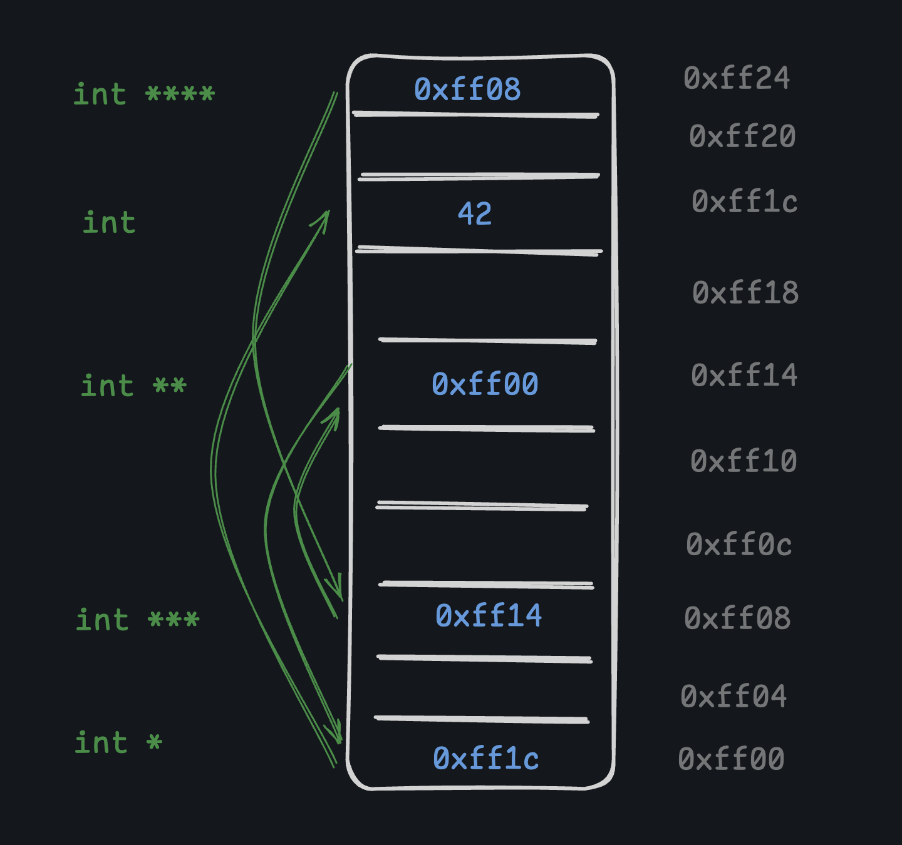

# Pointer-Pointers

Ok, so... now we know what pointers are. So let's learn it over again! A pointer-to-pointer in C is just a pointer variable that holds the address of another pointer.

This allows you to create complex data structures like arrays of pointers, and to modify pointers indirectly. The syntax is exactly what you would expect:

```c
int value;
int *pointer;
int **pointer_pointer;
```

Pointers to pointers (or pointers to pointers to pointers to pointers... you get the idea) are like a treasure map or a scavenger hunt. You start at one pointer and keep following the chain of addresses until you get to the final value. It's just a chain of dereferences.


