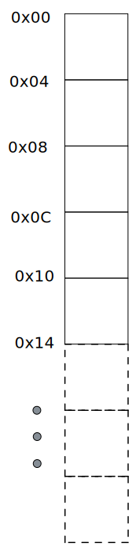

# RAM - Random-Access Memory / Stack / Heap

Der RAM (zu Deutsch: Arbeitsspeicher) ist ein flüchtiger Speicher in dem Daten für die Verarbeitung abgelegt werden und die ein Ausschalten nicht überleben. Intern ist der RAM wie eine lange Liste aufgebaut, siehe untenstehende Abbildung.

Es ist möglich an einer belibiegen Stelle im RAM Daten zu lesen und zu schreiben, daher auch der Name RAM - Random Access Memory.
Im Gegensatz dazu gibt es auch Speichertypen auf die nicht wahlfrei zugegriffen werden kann.

__Problem:__

Es entstehen Lücken im Datenspeicher. Diese Lücken reichen möglicherweise nicht aus um neue, zu große zusammenhängende Datensätze zu halten.
Daher bleibt Speicher ungenutzt und kann nicht befüllt werden, obwohl in Summe genügend Speicher übrig ist.

__Lösung:__

Das Betriebssystem übernimmt die Aufgabe dieses Problem zu lösen. Dadurch müssen sich Programmiersprachen sich an folgende Regeln halten. RAM muss kompakt verwendet werden. Das heißt, Daten müssen an die nächste freie Stelle angehängt werden. Das macht das schreiben schnell, da nicht erst eine freie Stelle gesucht werden muss. Es gibt einen sogenannten Stack Pointer der auf die nächste freie Stelle im Speicher verweist. Bei dieser Art der Speicherorganisierung spricht man vom Stack, da sich der Speicher wie ein Stapel aufstapelt.

__Der berühmte Stackoverflow:__

Lokale variablen gehören zu einer konkreten Funktion. Daten auf dem Stack werden gruppiert nach Funktionsaufrufen. Eine solche Gruppe von zusammengehörigen Werten heißt Stack Frame. Ein Stack Frame representiert einen einzelnen Funktionsaufruf. Ruft eine Funktion eine weiter Funktion auf wird auf dem Stack ein neuer Stack Frame erzeugt in dem dann die neuen Variablen der aufgerufenen Funktion enthalten sind. Der Stack Pointer zeigt stets auf das Ende des Stack Frames der aktuell ausgeführten Funktion. Sobald diese ausgeführten Funktion endet wird der Stack Pointer auf den Anfang des Stack Frames gesetzt. Spannend ist, dass die Daten der verlassenen Funktion sich noch auf Stack physisch befinden, aber sie werden durch den nächsten Funktionsaufruf überschrieben. Finden durchgehend neue Funktionsaufrufe statt, zum Beispiel durch eine Rekursion, ohne jemals eine Funktion zu beenden kommt es zum Stackoverflow, weil Stack Frame um Stack Frame angelegt und der Stack Pointer weitergebschoben wird und der RAM an sein Ende gelangt.

__Wie groß ist der Stack:__

Die Frage ist wieviel Speicher das Betriebssystem von dem RAM für den Stack bereitstellt. Dazu ist zu wissen, dass es nicht nur einen Stack gibt, sondern pro Thread einen Stack. Dies muss der Fall sein, damit mehrere Funktionen gleichzeitig ausgeführt werden können.

Hier könnte man einen Schlussstrich ziehen, das System ist sehr simpel. Man bräuchte nicht mal eine Garbage Collection. Doch jetzt kommt das große ABER. Neben dem Schreiben und Lesen von Werten gibgt es noch eine dritte Aktion. Das Ändern von Werten. Eine Variable in einer Programmiersprache hat denn Sinn geändert zu werden. Eigentlich ist das auch kein Problem, da auf dem Stack Werte gelesen und geschrieben (stichwort wahlfreier Zugriff) werden können, also somit verändert werden. Nehmen wir an auf dem Stack wurde ein Ganzzahl (z.B. die 32) gespeichert und diese soll mit einer anderen Ganzzahl (z.B. der 42) ersetzt werden, dann ist dies ohne weiteres Möglich, da jede Ganzzahl die GLEICHE (wichtig!) größe im Speicher (genauer Stack Frame) einnimmt. Je nach Platform werden Ganzzahlen nämlich als 32 -oder 64 bit repräsentiert, unabhänig ihres Inhaltes. Dieses gilt für alle Werte mit fester Größe, wie auch Fließkommazahlen, für logische Werte, ect.

Was aber passiert mit einer variablen Zeichenkette oder einem Objekt das zur Laufzeit neue Properties erhält. Prinzipiell gibt es zwei Möglichkeiten, wenn der neue Wert weniger Speicher bedarf als der Vorherige Wert, dann wird das Verändern theoretisch funktionieren, jedoch bleiben Lücken im Stack Frame. Wenn der neue Wert nun aber mehr Speicher benötigt, dann hat mein gravierendes Problem, man müsste den Stack Frame dynamisch vergrößern, was nicht vorgesehen ist.

Deshalb bedient man sich eines Tricks. Auf dem Stack werden nur die Daten abgelegt die eine Wert unabhängige feste Größe haben. Alle anderen Daten werden nicht auf dem Stack abgelegt, sondern außerhalb vom Stack. Auf dem Stack landet dann nur ein Pointer (ein Pointer ist immer gleich groß) der auf diese andere Stelle im Speicher verweist. Diese Stelle im Speicher ist der sogenannte Heap. Der Heap ist ebenfalls ein Speicher im RAM. Auf dem Heap entstehen Lücken, welche von Zeit zu Zeit geschlossen werden in dem Daten zusammengeszogen werden. Dieser Vorgang nennt sich Garbage Collection.

Daten die auf dem Stack abgelegt werden spricht man von Wertetypen (Valuetypes), da man direkt auf den Wert in dem Stack zugreift. Handelt es sich bei dem Wert um einen Datentyp mit variabler Größe spricht man von einem Referenztyp (Referencetype), da man sich erst den Pointer auf den Stack anschaut welcher auf die referenzierten Daten zeigt.

__Schmankerl:__ Call by reference ist eigentliche nichts anderes als ein call by value, jedoch wird ein pointer als Kopie übergeben (neuer Eintrag auf im Stack Frame), welcher dann wiederum auf den gleichen Speicherbereich auf dem Heap zeigt wie der zu übergebende Pointer.

__Sonderfall Zeichenketten (strings):__

Man möchte meinen, dass strings Referenztypen sind, welche auf dem Heap gespeichert werden, da ihre länge variable ist. Diese Annahme ist falsch, da Strings üblicherweise als unveränderbare Datentypen angesehen werden, also als immutable.
Das heißt das ein Sting niemals verändert wird, stattdessen wird immer ein neuer String erzeugt. Der Grund dafür ist ein String mehr als nur einmal vorkommt und mehr als nur einmal verwendet witd. Programmiersprachen führen daher ein Interning aus, das heißt das ein einmal erstellter String weiter verwendet wird. Technisch gesehen sind String Referenztypen, sie werden auch als solche übergeben, aber eine Veränderung eines Strings führt hier eben nicht dazu dass der String mitverändert wird sonder ein neuer String erzeugt wird. Wir haben es also mit einem Referenztyp zu tun der sich so verhält als wäre er ein Wertetyp.
