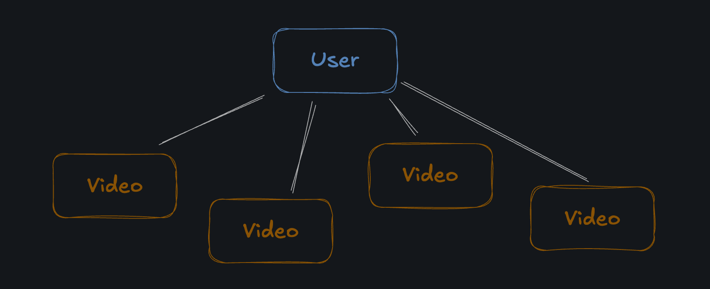

# Videos

The two main entities in Tubely are `videos` and `users`. A `user` can have many `videos`, and a `video` belongs to a single `user`.

“Videos” have 3 things to worry about:

- `Metadata`: The title, description, and other information about the video
- `Thumbnail`: An image that represents the video
- `Video`: The actual video file

Tubely allows users to create a “new draft” - which creates a new video record in the database containing metadata only. Thumbnails and video files are uploaded separately after the draft is created.

## Assignment

1. Create a new video with the following:

- `Title`: “Boots, an Emote Story”
- `Description`: “A short film about the many faces of Boots”

You should now see the video in the UI with options to upload a thumbnail and video file. Don’t upload the files yet.
