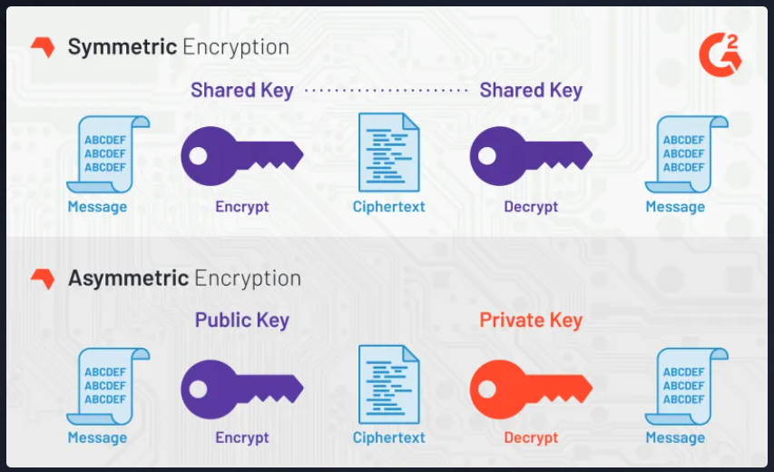

# Symmetric vs. Asymmetric

In the context of password managers, cryptography is used to secure data at rest. Typically, a "vault" of passwords is safely stored so that only authorized parties can gain access.

Protecting files at rest, or more specifically, protecting files for oneself is usually accomplished via symmetric encryption, which means encryption and decryption use the same key.

Asymmetric encryption uses two keys, and we'll talk more about it later.

Symmetric encryption should typically just be used to encrypt information for oneself. If you're encrypting data for someone else, you should use asymmetric encryption. There are a couple of reasons for this:

- You probably don't have a way to securely transport the key to another person
- When using asymmetric encryption, the decrypter will only be able to decrypt, so they can't modify the information in any way, giving you added protection

That said, symmetric encryption is great for what it's good at. Symmetric schemes are typically faster than asymmetric schemes, and they're easier to implement. If you encrypt your computer's hard-drive, it's probably done with symmetric encryption because it can be done quickly on large amounts of data.
