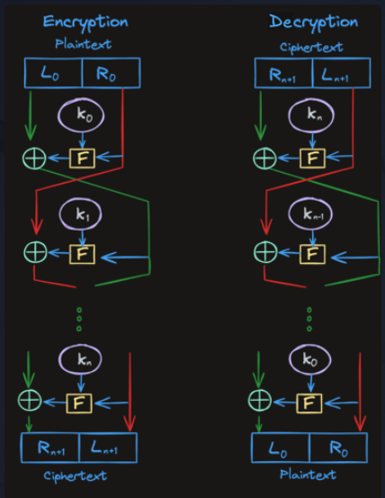

# Feistel Network

Many block ciphers, including DES which we'll be talking about soon, use a Feistel network (or "Feistel Cipher") as a key component of their encryption algorithms.

Feistel structures have the useful property that encryption and decryption operations are very similar and sometimes identical. Decryption only requires a reversal of the key schedule. This keeps the implementation of the algorithms simple and concise.

!

- `n` = The number of ciphering rounds
- `L0` = Left half of plaintext
- `R0` = Right half of plaintext
- `K0 - Kn` = The round keys (from a key schedule)
- `F` = The round function (specific to the ciphering algorithm, like DES for example)

One of the most interesting things about Feistel networks is that the round function does NOT have to be reversible.

## Assignment

For marketing purposes, Passly has decided to create its own Feistel network. It will use the Go standard library's SHA-256 hash function as the round function.

Here's some pseudocode:

### feistel(msg []byte, roundKeys [][]byte) []byte

- Split the message into equal left and right-hand sides of equal length.
- For each round:
    - nextRHS = xor(lhs, hash(rhs+key))
    - nextLHS = oldRHS
- When you're done with all the rounds, return the concatenation of the right and left-hand sides (right first, then left)

The hash() function is provided for you.

### Solution

```go
package main

func feistel(msg []byte, roundKeys [][]byte) []byte {
	lhs := msg[:len(msg)/2]
	rhs := msg[len(msg)/2:]
	for _, roundKey := range roundKeys {
		nextLeft := rhs
		hashedData := hash(rhs, roundKey, len(roundKey))
		rhs = xor(lhs, hashedData)
		lhs = nextLeft
	}
	return append(rhs, lhs...)
}

```

// helpers.go

```go
package main

import (
	"crypto/sha256"
)

func reverse[T any](s []T) []T {
	for i, j := 0, len(s)-1; i < j; i, j = i+1, j-1 {
		s[i], s[j] = s[j], s[i]
	}
	return s
}

func xor(lhs, rhs []byte) []byte {
	res := []byte{}
	for i := range lhs {
		res = append(res, lhs[i]^rhs[i])
	}
	return res
}

// outputLength should be equal to the key length
// when used in feistel so that the XOR operates on
// inputs of the same size
func hash(first, second []byte, outputLength int) []byte {
	h := sha256.New()
	h.Write(append(first, second...))
	return h.Sum(nil)[:outputLength]
}
```