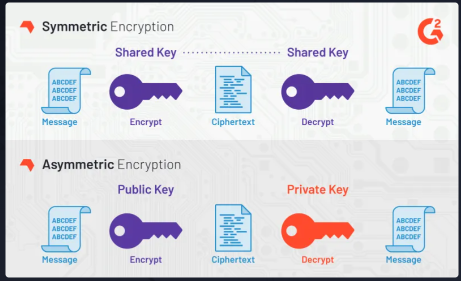

# Asymmetric Encryption

Asymmetric cryptography, also known as "public-key cryptography", has the same goal as symmetric cryptography: to encrypt and decrypt data. However, asymmetric cryptography uses two different keys to do it.



Each pair of keys has a public key and a corresponding private key. The security of public-key cryptography depends on keeping the private key secret. The public key can be given freely to anyone without compromising security.

## Assignment

At Passly, we use Elliptic Curve Cryptography (ECC) for our public-key cryptography needs in production.

Complete the genKeys() function. Use the ecdsa.GenerateKey function from the standard library, along with the elliptic.P256() curve.

We won't be checking the values of the keys, so feel free to use a secure random source from the crypto/rand package.

### Solution

```go
package main

import (
	"crypto/ecdsa"
	"crypto/elliptic"
	"crypto/rand"
)

func genKeys() (pubKey *ecdsa.PublicKey, privKey *ecdsa.PrivateKey, err error) {
	privateKey, err := ecdsa.GenerateKey(elliptic.P256(), rand.Reader)
	if err != nil {
		return nil, nil, err
	}
	return &privateKey.PublicKey, privateKey, nil
}
```