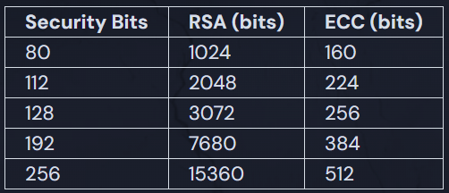

# RSA vs. ECC

To be clear, RSA is still widely used in production and is still considered secure. Where ECC shines is that it is a bit more efficient in terms of both speed and memory usage. Let's take a look at some of the differences between RSA and ECC.

## RSA

- RSA key sizes are larger, 2048, 3072, or 4096 bits to remain secure
- RSA's security is based on the difficulty of factoring large numbers
- RSA is relatively slow. Because of this, it is not commonly used to directly encrypt user data. More often, RSA is used to transmit shared keys for symmetric-key cryptography, as it does in TLS/HTTPS.

## ECC

ECC key sizes are smaller, typically 256 bits are enough to remain secure
ECC's security is based on the mathematics of elliptic curves

## Comparing Key Sizes

To get `2^256` combinations, RSA requires `15360` bits in a private key, while ECC requires only `512` bits. That's a huge difference! You can save a lot of memory and processing power if you're using a lot of keys. That's why systems like Bitcoin use ECC.
