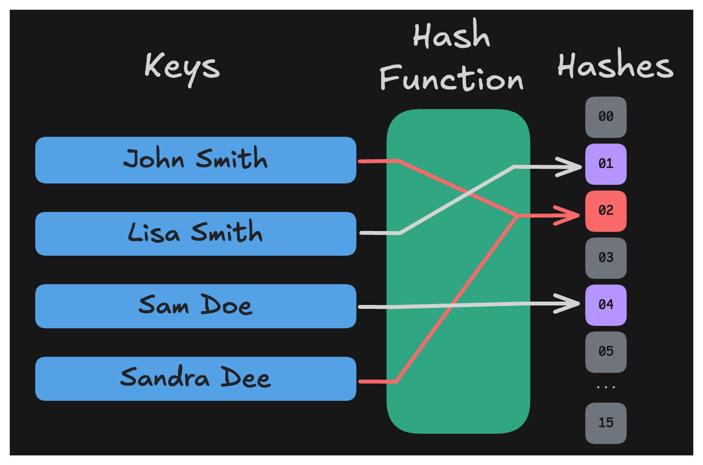

# Hash Collisions

In the SHA-256 hash we just implemented, there are an infinite number of possible inputs, but only 2^256 possible outputs. This means that there is a chance (albeit a very small one) that two different inputs can result in the same output.

When this happens, it's called a collision.

Take a look at this simplified diagram of a hash function:

The "hash table", or the number of total possible outputs in this case are the numbers 0-15. Every conceivable input to this function will result in a number between 0 and 15. As you can imagine, with this small number of possible outputs, many different inputs will map to the same outputs. That's a problem, collisions are bad.

For example, in the image above, both "John Smith" and "Sandra Dee" share a digest (output) of 02.

Because the number of potential inputs to a hash function is always infinite, every hash function has the potential for collisions. However, the larger the hash table (number of possible outputs) the less likely that two inputs will collide. Good hash functions, like SHA-256, make collisions extremely unlikely.