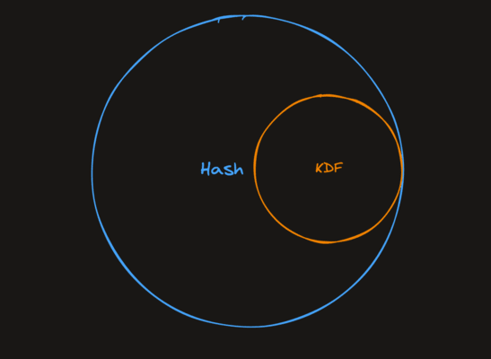

# Key Derivation Functions

A key derivation function (KDF) is a special kind of hash function that specializes in deriving one or more secret keys from a secret value, such as a password.

All KDFs are hash functions, but not all hash functions are KDFs.

There are 4 primary reasons to use a KDF, and I've ordered them from most the common use cases to the least common:

1. Key Stretching
2. Key Separation
3. Key Whitening
4. Key Strengthening

## 1. Key Stretching

Key stretching takes a short key and stretches it into a longer key. This is useful when you need a longer key than what you have available. For example, it's common to take a human-friendly password and stretch it into a 256-bit key

## 2. Key Separation

KDFs can create multiple child keys from a master key. You may remember that we talked about this process when we worked with the Feistel Cipher. This is helpful because you only need to remember or store the master, and can deterministically generate the child keys when you need them.

## 3. Key Whitening

Key whitening increases the security of block ciphers by combining portions of the data with the key.

## 4. Key Strengthening

Less common than stretching, strengthing extends a key with a random salt, but then deletes the salt so it can’t be used again. This strengthens the resulting key, but comes at a strong inconvenience because even legitimate users won't be able to derive the original easily.