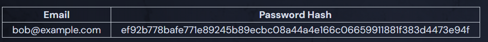

# Why Are KDFs Slow?

SHA-256 and MD5 are examples of fast hashes and are bad for storing password hashes. KDFs like Scrypt and Bcrypt are both extremely slow and are good for passwords.

Always use slow KDFs for storing user passwords, never fast hashes.

If an attacker gains access to a database of password hashes made with fast algorithms it is easy for them to "reverse" the hashes by guessing different inputs and seeing if the outputs match. For example, let's say the attacker finds the following entry in a database:



They can try hashing common passwords like:

```txt
password -> 0b14d501a594442a01c6859541bcb3e8164d183d32937b851835442f69d5c94e
01011994 -> 6cf615d5bcaac778352a8f1f3360d23f02f34ec182e259897fd6ce485d7870d4
password123 -> ef92b778bafe771e89245b89ecbc08a44a4e166c06659911881f383d4473e94f
```

By trying common passwords, they can quickly find a matching hash! In the example above, `password123` matched.

Now the attacker knows that `bob@example.com` is likely to use the password `password123` on other sites and can go hack their accounts. This is only possible because the attacker can quickly compute many hashes per second and guess millions of potential passwords. If they were going through a login form, the server would probably block them after a few failed attempts.

## KDFs Fix This

In contrast, a slow hash function (KDF) will run so painfully slow that the attacker is unable to make enough guesses to be able to brute force their way to the plaintext of any passwords.
