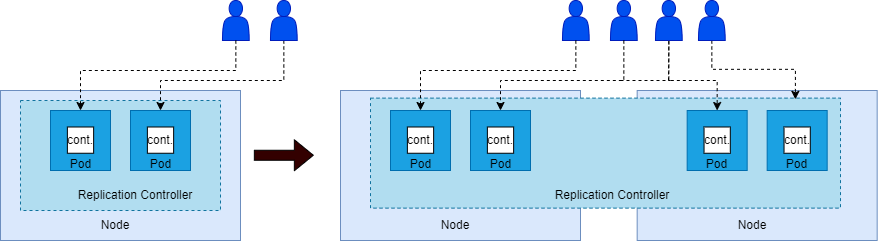

# Controller

In this section we will discuss a specific controller, the ReplicaSet.

The `replication controller` helps to run _multiple_ instances of a single pod in the kubernetes cluster. Even a _single_ pod will be re-created by the `replication controller` if the pod failes for some reason.

This provides __high availability__.

The `replication controller` ensures that the specified number of pods are running at all times.

## Load balancing & scaling

A replication controller is also needed to create multiple pods and share the load between them.



The replica controller spans across multiple nodes.
It helps to load the balance between different pods on different nodes.

## Terms

There are two similar terms.

__1. Replication Controller__
__2. Replica Set__

Both have the same purpose but they are not the same!

Replication controller is the older technology which is beeing replaced by the new replica set.

I used the terms in this document interchangeably.

## Commands with kubeclt

```CLI
    kubectl create -f replicaset-definition.yaml
```

```CLI
    kubectl get replicaset
```

This command will also delte all underlaying PODs.

```CLI
    kubectl delete replicaset myapp-replicaset
```

```CLI
    kubectl replace -f replicaset-definition.yaml
```

```CLI
    kubectl scale replicaset=6 -f replicaset-definition.yaml
```

```CLI
    kubectl edit replicaset my-replicaset
```