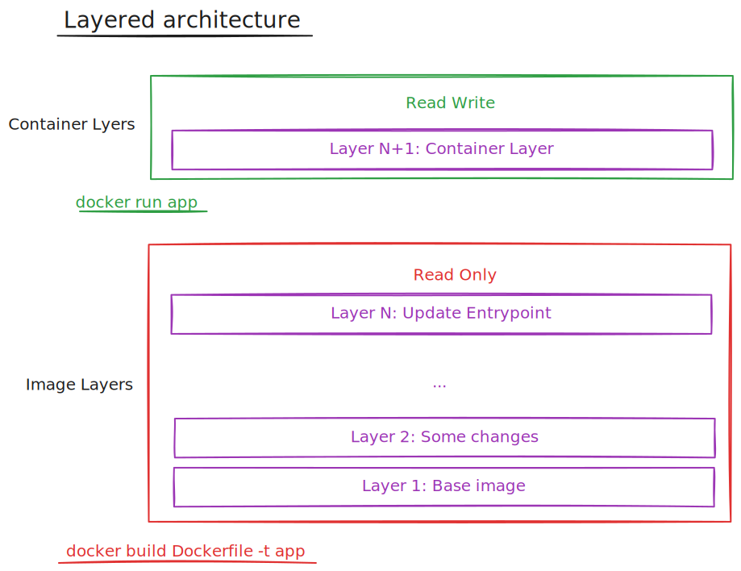
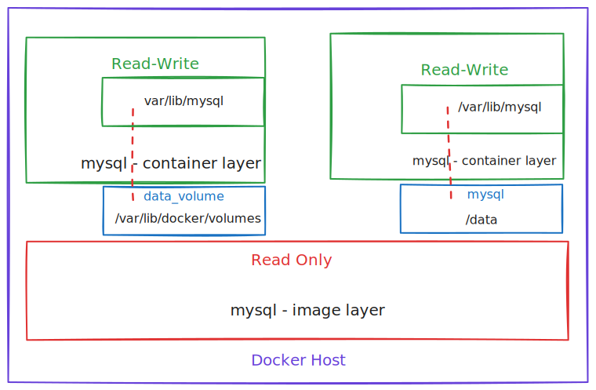

# Docker Storage

READ the docs: <https://docs.docker.com/storage/storagedriver/>

To understand Kubernetes Storages we need to understand storages in docker.
There are two ways to use storages:

- Storage Driver
- Volume Drivers

## Storage Drivers

### File System

If you install docker an a system it will craete this file structure:

`/var/lib/docker`

in this folder docker storea all its data in subfolders:

- /aufs
- /containers
- /image
- /volumes

How does docker store the files for an image and a container?
It does that in a layerd architecture.

### Layered Architecture

When docker builds images, it builds this in a layers. Each line of instruction in the dockerfile creates a new layer in the docker image with just the changes compared to the previous layer.

When having a dockerfile that has the same steps, the layer from the cache are used. No rebuild of layers is necessary.

When building the dockerfile the Image Layers are Read Only. When run the Image a new writable layer will be created, the Container Layer.
This layer is used to store data created by the container such as log files, temp files, any file modified by the user. This layer will be destroyed when the container stops. All the data that was written in this layer is lost.

If you modify a file that is in the read only layer, e.g. some code, then docker will createa a copy of this file and hold in the read-write layer (Container layer). This mechanism is called COPY-ON-WRITE.

### Volumes

To persist data created by the container we can add a persistent volume to the conainter.

#### Volume mounting

`docker volume create data_volume` will create a volume in: `/var/lib/docker/volumes/data_volume`.

When you run the container you can mount this volume inside the conainers read-write layer using the -v option like so:

`docker run -v data_volume:/var/lib/mysql mysql`

#### Bind mounting

If we want to bind an folder instead of a volume that is handled by docker in the volumes folder we can run:

`docker run -v /data/mysql:/var/lib/mysql mysql`

where the first part before ":" is the folder on our host that we want to bind to a folder in the container specfied after ":".

> Note: -v is an old option, the new way is to use --mount.

#### Storage drivers

Who is in charge of handling all the volume related operations, like creating a read-only layer, copy files to the read-write layer and so on?

Docker uses storage drivers to enable layerd architecture. A list of some storage drivers:

- AUFS (default for Ubuntu)
- ZFS
- BTRFS
- Device Mapper
- Overlay
- Overay2

---

Keep in mind that Storage drivers are not the same as Volume drivers. Here a text from the docker documentation:

#### Storage drivers versus Docker volumes

"Docker uses storage drivers to store image layers, and to store data in the writable layer of a container. The container's writable layer doesn't persist after the container is deleted, but is suitable for storing ephemeral data that is generated at runtime. Storage drivers are optimized for space efficiency, but (depending on the storage driver) write speeds are lower than native file system performance, especially for storage drivers that use a copy-on-write filesystem. Write-intensive applications, such as database storage, are impacted by a performance overhead, particularly if pre-existing data exists in the read-only layer.

Use Docker volumes for write-intensive data, data that must persist beyond the container's lifespan, and data that must be shared between containers. Refer to the volumes section to learn how to use volumes to persist data and improve performance."
