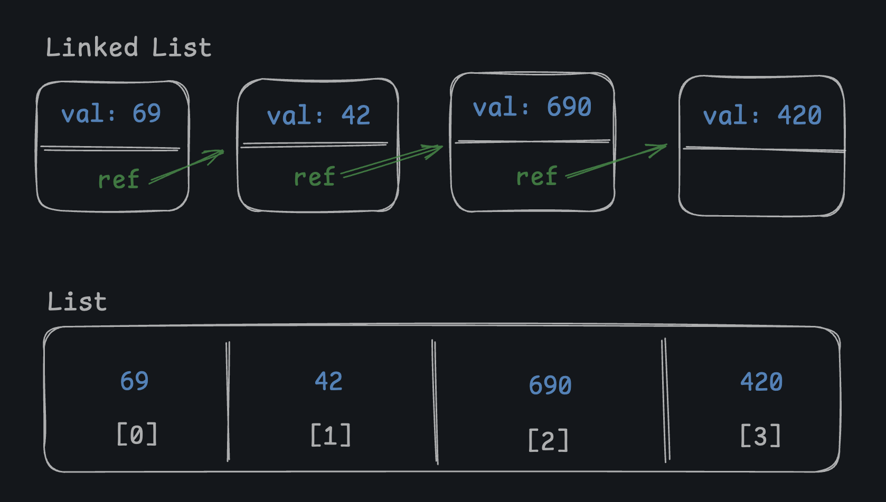
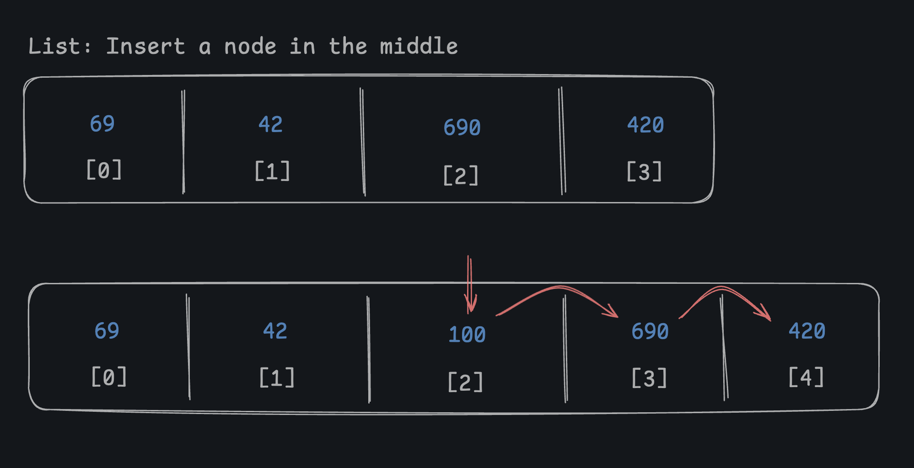
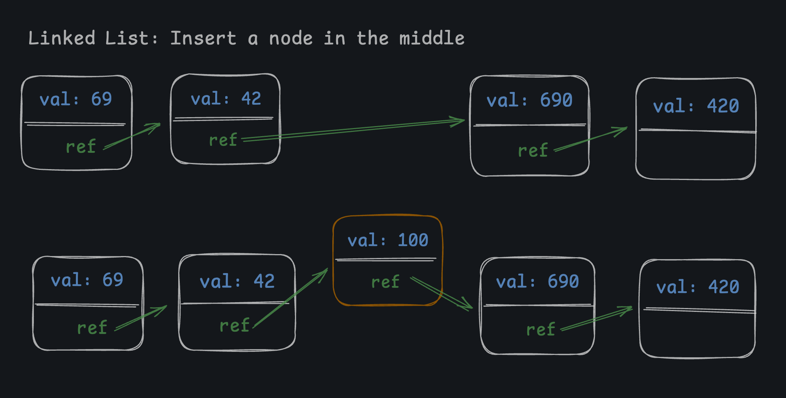

# Linked List vs List

A linked list is a collection of ordered items. In that way, it's similar to a "normal" list (also called an "array" or "slice" in other languages).



The difference is that Items in a "normal" list are stored next to each other in memory, and to get an item from a List we use a numbered index:

```py
car = cars[1]
```

You can think of the "index" as simply an offset from the start. With a normal list, all the data is stored in the same place in memory and the index is just a way to find the right spot.

In a linked list, there are no indexes. Each node contains the data itself as well as a reference to the next node in the list. Iterating over a linked list requires starting at the head node and following the next references until you reach the end.

```py
current_car_node = head_car_node
while current_car_node is not None:
    print(current_car_node.val)
    current_car_node = current_car_node.next
```

This kind of iteration is annoying, and has more overhead, so why use a linked list? We use them sometimes because linked lists are much faster to make updates to, particularly when inserting or deleting items from the middle. In a normal list, if you insert an item in the middle, you have to shift all the items after it down one spot (O(n)):



In a linked list, you can simply update a couple of references (O(1))


