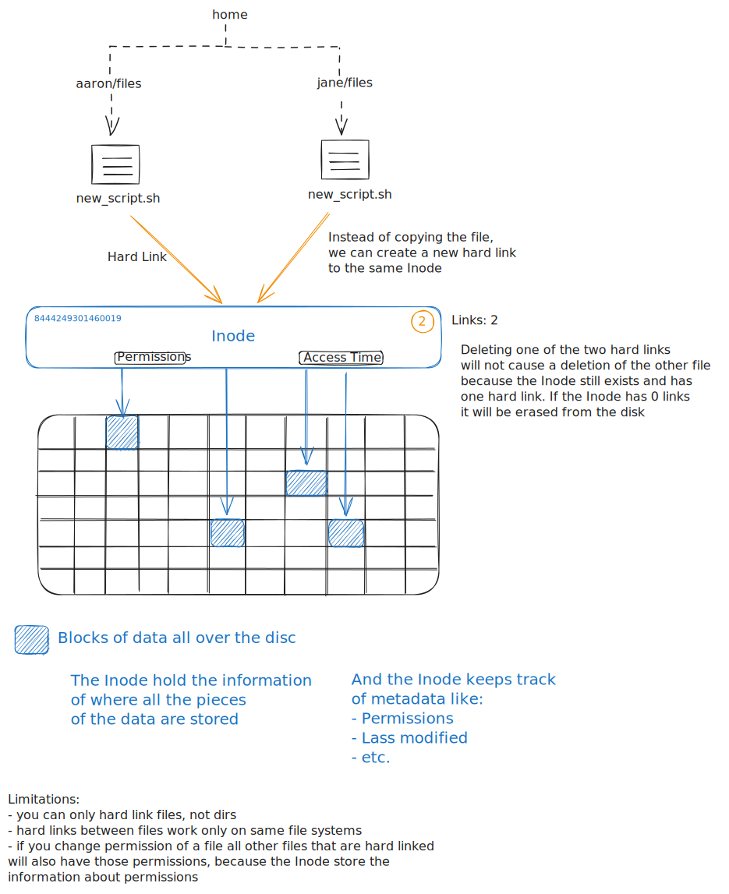

# Essential Commands

## Create, delete, copy, move files and directories

```SHELL
# list all files and dirs in your current directory
ls # list
```

```SHELL
# list even the hidden files and directories
ls -a # list all
```

```SHELL
# list with more information about the files and directories
ls -l # list all in a long format
```

```SHELL
# combine -a and -l
ls -al # = ls -a -l
```

```SHELL
# -h to show data size in human readable form
ls -alh
```

Note: skipped this section, because content is trivial. What was covered:

- Filetree
- mv command
- cp command

## Create and manage links

```SHELL
# the stat command lets you inspect details about a file
stat new_script.sh

File: new_script.sh
Size: 734       	Blocks: 8          IO Block: 4096   regular file
Device: afh/175d	Inode: 8444249301460019  Links: 1
Access: (0777/-rwxrwxrwx)  Uid: ( 1000/  fwilms)   Gid: ( 1000/  fwilms)
Access: 2024-03-18 17:47:27.253250900 +0100
Modify: 2024-02-06 14:01:13.535380100 +0100
Change: 2024-02-06 14:01:13.539942400 +0100
 Birth: -
```

### Hard Link

```SHELL
# create a hard link
ln path_to_target_file path_to_link_file
```



### Soft Link

```SHELL
# create a soft link (symbolic link)
ln -s path_to_target_file path_to_link_file
```

