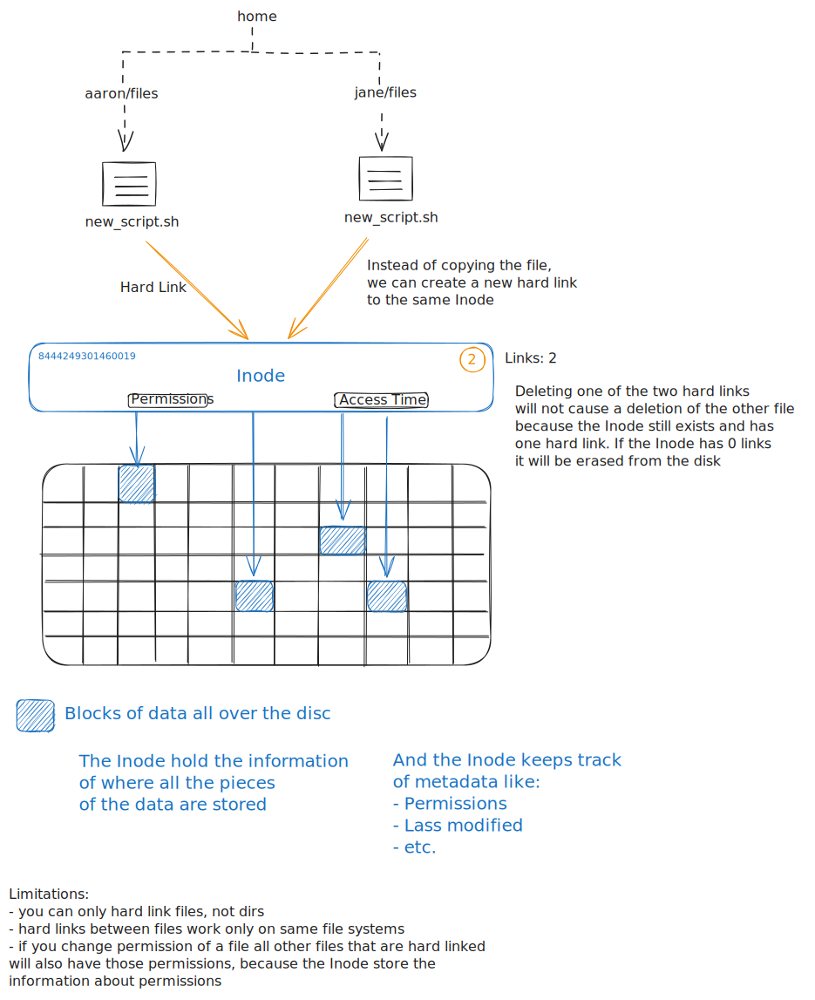
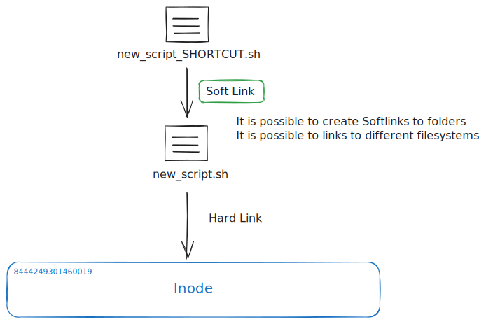
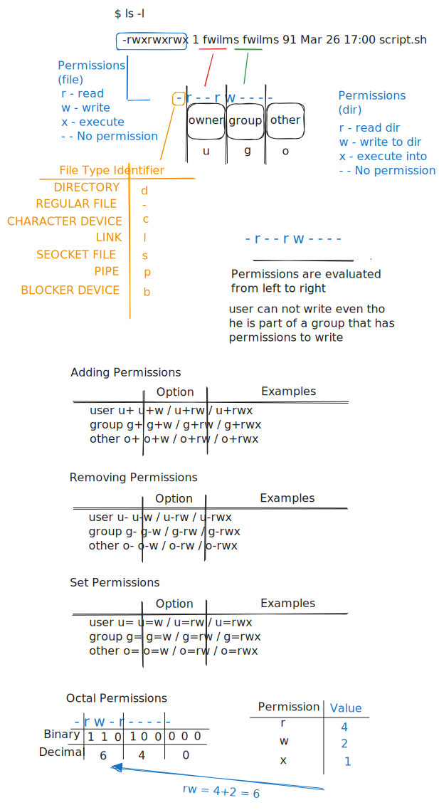

# Essential Commands

## Create, delete, copy, move files and directories

```SHELL
# list all files and dirs in your current directory
ls # list
```

```SHELL
# list even the hidden files and directories
ls -a # list all
```

```SHELL
# list with more information about the files and directories
ls -l # list all in a long format
```

```SHELL
# combine -a and -l
ls -al # = ls -a -l
```

```SHELL
# -h to show data size in human readable form
ls -alh
```

Note: skipped this section, because content is trivial. What was covered:

- Filetree
- mv command
- cp command

## Create and manage links

```SHELL
# the stat command lets you inspect details about a file
stat new_script.sh

File: new_script.sh
Size: 734       	Blocks: 8          IO Block: 4096   regular file
Device: afh/175d	Inode: 8444249301460019  Links: 1
Access: (0777/-rwxrwxrwx)  Uid: ( 1000/  fwilms)   Gid: ( 1000/  fwilms)
Access: 2024-03-18 17:47:27.253250900 +0100
Modify: 2024-02-06 14:01:13.535380100 +0100
Change: 2024-02-06 14:01:13.539942400 +0100
 Birth: -
```

### Hard Link

```SHELL
# create a hard link
ln path_to_target_file path_to_link_file
```



### Soft Link

```SHELL
# create a soft link (symbolic link)
ln -s path_to_target_file path_to_link_file
```



## File Permissions



```SHELL
# change group
chgrp wheel new_script.sh
```

```SHELL
# change owner
# only the root user can change owner (sudo)
sudo chown jane new_script.sh
```

```SHELL
# change permissions
# chmod - change mode
chmod o+w new_script.sh
```

## SUID, SGID, Sticky Bit

### SUID

```SHELL
# SUID
chmod 4664 new_script.sh

ls -l
-rwSrwxrwx # an S in the execution position of the owner permission
# will be executed as the user that set the SUID to it
```

### SGID

```SHELL
# SGID
chmod 2664 new_script.sh

ls -l
-rw-rwSrwx # an S in the execution position of the group permission
```

### Sticky Bit

```SHELL
# Only the user owner can remove the directory where the sticky bit is set
chmod +t mydir
```

## Search files

```SHELL
# find files that are larger than 10 Megabytes
find /lib64/ -size +10M
```

```SHELL
# find files that are modified in the last minute
find /dev/ -mmin -1 # modified minute
```

```SHELL
# find files that starts with f
find -name "f*"
```

```SHELL
# find files that have exactlythese permissions
find -perm 644
```

```SHELL
# find files that have at lease these permissions
find -perm -644
```

## Compare and manipulate files

```SHELL
cat myfile.txt
```

```SHELL
# like cat but in reverse order
tac myfile.txt
```

```SHELL
# cat but the last n lines of the file
tail -n 20 myfile.txt
```

```SHELL
# cat but the first n lines of the file
head -n 20 myfile.txt
```

```SHELL
# search and replace, sed - stream editor
sed -i 's/canda/canada/g' /myfile.txt
# g: global - will replace even if more occurences in one line
# -i: in place, it will edit the file, without -i sed only shows what it would do
```

```SHELL
# extract the stuff we need from a file
cut -d ' ' -f 1 myfile.txt
# -d: delimiter
# -f: field
```

```SHELL
# get unique entries
sort myfile.txt | uniq 
```

```SHELL
# compare files
diff -c myfile.txt myfile2.txt
# -c: context
```

```SHELL
# compare files side by side
sdiff myfile.txt myfile2.txt
```

## Regular expressions

Regex operators:

- `^`
- `$`
- `.`
- `*`
- `+`
- `{}`
- `?`
- `|`
- `[]`
- `()`
- `[^]`

### ^

```SHELL
# lines that start with sam: use ^
grep '^sam' myfile.txt'
```

### $

```SHELL
# lines that end with sam: use $
grep 'sam$' myfile.txt'
```

### .

```SHELL
# escape period to search for a regular period
grep '\.' myfile.txt'
```

### *

```SHELL
# *: zero or more times
# will search for le, let, lett, lettt, ....
grep -r 'let*' /etc/
# -r: Recursively search subdirectories listed
```

### +

```SHELL
# +: one or more times
# will search for let, lett, lettt, ....

# Note: \+ instead of +, because grep undestands only basic expressions. 
# MAN page tells us to escape + for searching.
grep -r 'let\+' /etc/

# OR use grep -E for extended regular expression
grep -Er 'let+' /etc/

# OR use egrep
egrep -r 'let+' /etc/
# -r: Recursively search subdirectories listed
```

### {}

```SHELL
# {}:  exists this many times

# matches three zeros at least
egrep -r '0{3,}' /etc/

# matches exactly three zeros
egrep -r '0{3}' /etc/
```

## Work with SSL Certificates

When we talk about `SSL` we mean actually `TLS`.
`SSL` stands for `secure sockets layer`.
`TLS` stands for `transport layer security`.

`SSL` had a lot of security issues and `TLS` closed those wholes.
For more information see: [[HTTPSZertifikate]].
