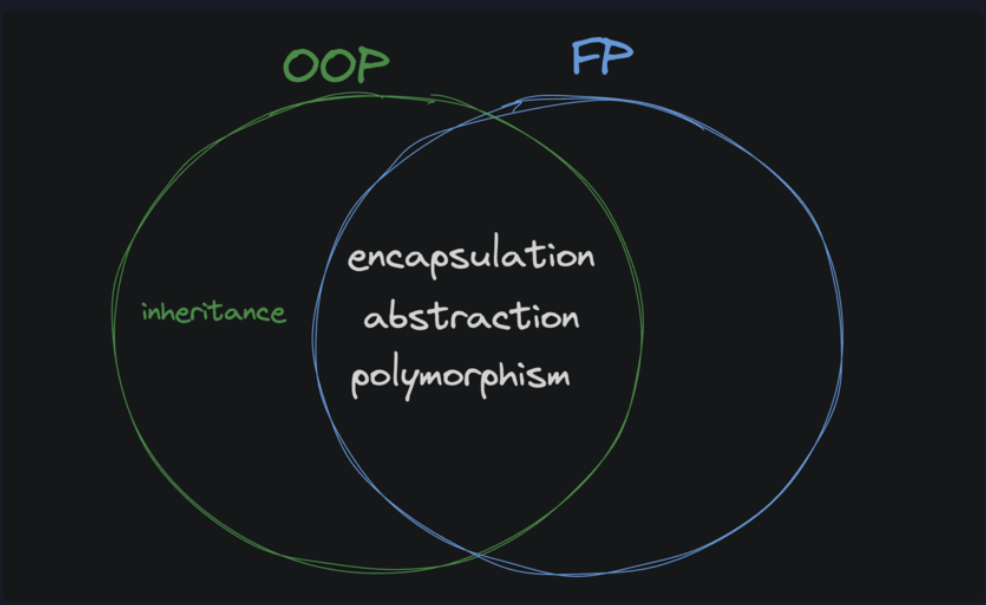

# Functional vs OOP

Functional programming and object-oriented programming are styles for writing code.
One isn't inherently superior to the other, but to be a well-rounded developer you should understand both well and use ideas from each when appropriate.

You'll encounter developers who love functional programming and others who love object-oriented programming.
However, contrary to popular opinion, FP and OOP are not always at odds with one another.
They aren't opposites.
Of the four pillars of OOP, inheritance is the only one that doesn't fit with functional programming.

Inheritance isn't seen in functional code due to the mutable classes that come along with it. Encapsulation, polymorphism and abstraction are still used all the time in functional programming.

When working in a language that supports ideas from both FP and OOP (like Python, JavaScript, or Go) the best developers are the ones who can use the best ideas from both paradigms effectively and appropriately.
