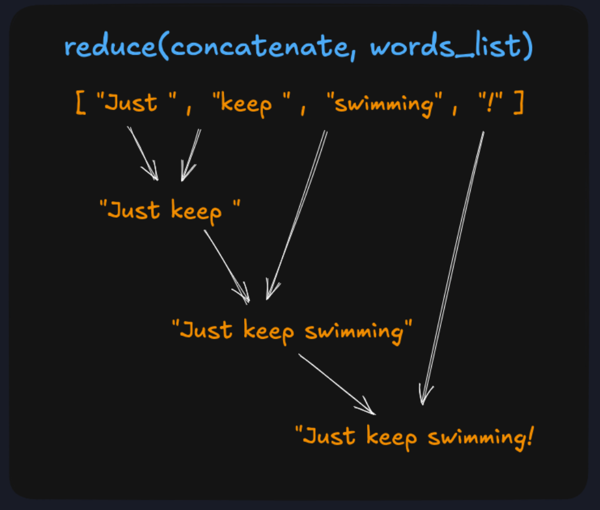

# Map, Filter, Reduce

## Map

"Map", "filter", and "reduce" are three commonly used higher-order functions in functional programming.

In Python, the built-in map function takes a function and an iterable (in this case a list) as inputs. It returns an iterator that applies the function to every item, yielding the results.

With map, we can operate on lists without using loops and nasty stateful variables. For example:

```py
def square(x):
    return x * x

nums = [1, 2, 3, 4, 5]
squared_nums = map(square, nums)
print(list(squared_nums))
# [1, 4, 9, 16, 25]
```

## Filter

The built-in filter function takes a function and an iterable (in this case a list) and returns a new iterable that only contains elements from the original iterable where the result of the function on that item returned True.

```py
def is_even(x):
    return x % 2 == 0

numbers = [1, 2, 3, 4, 5, 6]
evens = list(filter(is_even, numbers))
print(evens)
# [2, 4, 6]
```

## Reduce

The built-in functools.reduce() function takes a function and a list of values, and applies the function to each value in the list, accumulating a single result as it goes.



```py
# import functools from the standard library

import functools

def add(sum_so_far, x):
    print(f"sum_so_far: {sum_so_far}, x: {x}")
    return sum_so_far + x

numbers = [1, 2, 3, 4]
sum = functools.reduce(add, numbers)
# sum_so_far: 1, x: 2
# sum_so_far: 3, x: 3
# sum_so_far: 6, x: 4
# 10 doesn't print, it's just the final result
print(sum)
# 10
```

## Map, Filter, and Reduce Review

Higher-order functions like map, filter, and reduce, allow us to avoid stateful iteration and mutations of variables.

Take a look at this imperative code that calculates the factorial of a number:

```py
def factorial(n):
    # a procedure that continuously multiplies
    # the current result by the next number
    result = 1
    for i in range(1, n + 1):
        result *= i
    return result
```

Here's the same factorial function using reduce:

```py
import functools

def factorial(n):
    return functools.reduce(lambda x, y: x * y, range(1, n + 1))
```

In the functional example, we're just combining functions to get the result we want. There's no need to reassign variables or keep track of the program's state in a loop.

A loop is inherently stateful. Depending on which iteration you're on, the i variable has a different value.
