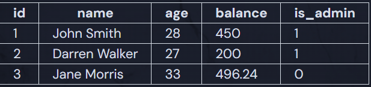

# SQL Select Statement

Let's write our own SQL statement from scratch! A `SELECT` statement is the most common operation in SQL - often called a "query". `SELECT` retrieves data from one or more tables. Standard `SELECT` statements do not alter the state of the database.

```sql
SELECT id FROM users;
```

## Select a Single Field

A SELECT statement begins with the keyword SELECT followed by the fields you want to retrieve.

```sql
SELECT id FROM users;
```

## Select Multiple Fields

If you want to select more than one field you can specify multiple fields separated by commas.

```sql
SELECT id, name FROM users;
```

## Select All Fields

If you want to select every field in a record you can use the shorthand * syntax.

```sql
SELECT * FROM users;
```

After specifying fields, you need to indicate which table you want to pull the records from using the FROM statement followed by the name of the table. We'll talk more about tables later, but for now, you can think about them like structs or objects. For example, the users table might have 3 fields:

- `id`
- `name`
- `balance`

And finally, all statements end with a semi-colon `;`.

## Assignment

The state of our CashPal `users` table is as follows:



It's very common to write queries that only return specific portions of data from a table. Our HR team has requested a report asking for all the names and balances of all of our users.

Write a query that retrieves all of the names and balances from the users table.

### Solution

```sql
SELECT name, balance from users;
```
