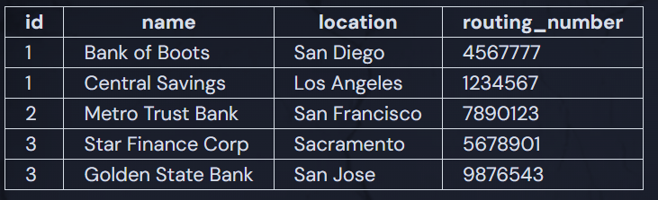

# Missing Constraint

CashPal has a table called `banking_institutions` that stores information related to banks in the area. A couple of CashPal users have called and left concerned messages because they've noticed incorrect bank info on some of their statements. You've been asked to take a look at the `banking_institutions` table and figure out if something is wrong with the table's constraints.

## Suspicious Records



## Challenge

Using the `up.sql` file tab and the example output above, determine which field is missing an important constraint. Because SQLite does not support adding constraints with `ALTER TABLE`, you'll have to make a new table called `banks`. It should have all the same fields as the original table but updated with the missing constraint. Don't worry about inserting any records, we'll learn how to do that later.

Note: `INT` is valid, but the assignment expects `INTEGER`, so use `INTEGER` instead of `INT` to pass this assignment.

### Solution

```sql
CREATE TABLE banks (
    id INTEGER PRIMARY KEY,
    name TEXT NOT NULL,
    location TEXT NOT NULL,
    routing_number INTEGER NOT NULL
);

-- TEST SUITE, DON'T TOUCH BELOW THIS LINE --

PRAGMA TABLE_INFO('banks');
```

The `PRIMARY KEY` was missing.
