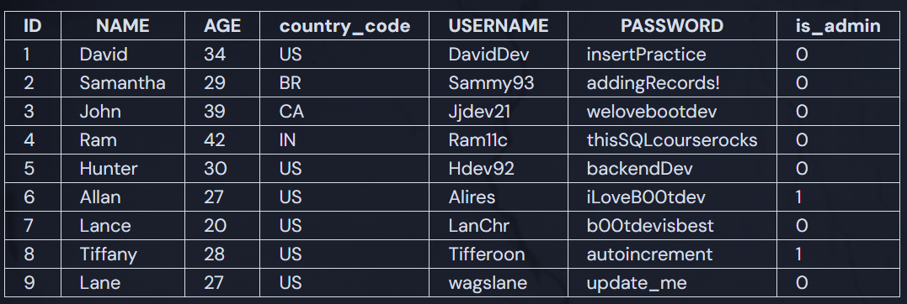

# DELETE

When a user deletes their account on Twitter, or deletes a comment on a YouTube video, that data needs to be removed from its respective database.

## DELETE Statement

A `DELETE` statement removes all records from a table that match the `WHERE` clause. As an example:

```sql
DELETE FROM employees
    WHERE id = 251;
```

This `DELETE` statement removes all records from the `employees` table that have an id of `251`!

## Assignment

Samantha, one of our CashPal users, has opted to delete her account and stop using our app... which makes us sad. Anyways, we need to remove her record from the database!

Delete Samantha's record from the user table.

### Current State of the users Table



### Solution

```sql
DELETE FROM users WHERE id = 2;

-- TEST SUITE, DON'T TOUCH BELOW THIS LINE --

SELECT * FROM users;
```
