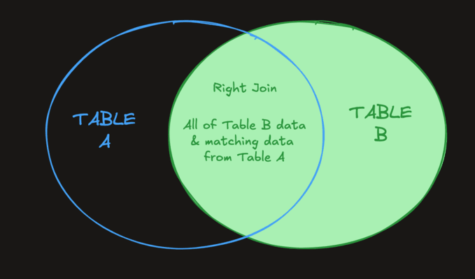

# Right Join

A `RIGHT JOIN` is, as you may expect, the opposite of a `LEFT JOIN`. It returns all records from `table_b` regardless of matches, and all matching records between the two tables.

A RIGHT JOIN is just a LEFT JOIN with the order of the tables switched, so in most cases LEFT JOIN is preferred for readability.

