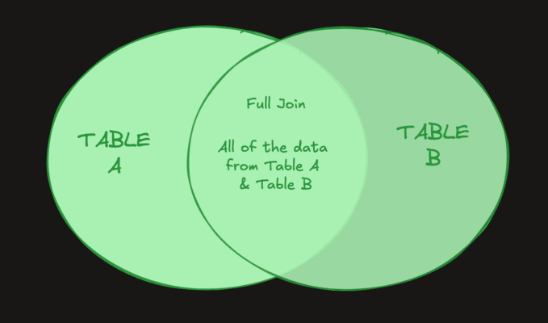

# Full Join

A `FULL JOIN` combines the result set of the `LEFT JOIN` and `RIGHT JOIN` commands. It returns all records from both from `table_a` and `table_b` regardless of whether or not they have matches.

